# 基礎編

## 起動と終了

```sh
# コンテナ作成 & 起動
docker-compose up -d
# コンテナ停止
docker-compose stop
# コンテナ起動
docker-compose start
# コンテナ停止 & 削除
docker-compose down
```

データは`Named Volume`というDockerが管理するボリュームに保存され、
`docker-compose down`しても削除されません。

データを削除したい場合は `docker volume rm` を利用してください。


## 接続

### psqlコマンドで

```sh
# 汎用側
docker-compose exec db psql -U root -d atlasaz
# 全文検索側
docker-compose exec db_fts psql -U root -d atlasaz
```

### PGadminで

http://localhost:8081/ にアクセスしてください。
ユーザー名とパスワードはどちらも `root` です。

PGAdminにログインできたら、サーバの情報を追加します。
接続情報は以下のとおりです(docker-compose.ymlも参照してみてください)。

- 汎用(PostGIS側)
  - ホスト名: db
  - ユーザー名: postgres
  - パスワード: root
- 全文検索
  - ホスト名: db_fts
  - ユーザー名: postgres
  - パスワード: root


## バックアップと復旧

下記のコマンドを実行すると、dataディレクトリにbackup.tarという名前でバックアップが作成されます。

```sh
# 汎用側
docker-compose exec backup tar cvf /backup/db_backup.tar /data/db-data
# 全文検索側
docker-compose exec backup tar cvf /backup/fts_backup.tar /data/db-fts-data
```

下記のコマンドを実行することで、リストアできます。

```sh
# 念のため停止
docker-compose stop db_fts
# ファイルの展開
# 汎用側
docker-compose exec backup tar xvf /backup/db_backup.tar
# 全文検索側
docker-compose exec backup tar xvf /backup/fts_backup.tar
# 起動
docker-compose start db_fts
```

**補足**

各コンテナのデータは`Named Volume`というボリュームに格納しています。
バックアップ・リストアを簡単にするために、これらのボリュームを`backup`コンテナでまとめてマウントしています。

ホストと各コンテナのマウント対応は以下のようになります。



### メモ

```sql
insert into atlasaz.test values (2, 'fuga');
insert into az_groonga.test values (2, 'fuga');
select * from atlasaz.test;
select * from az_groonga.test;
```
